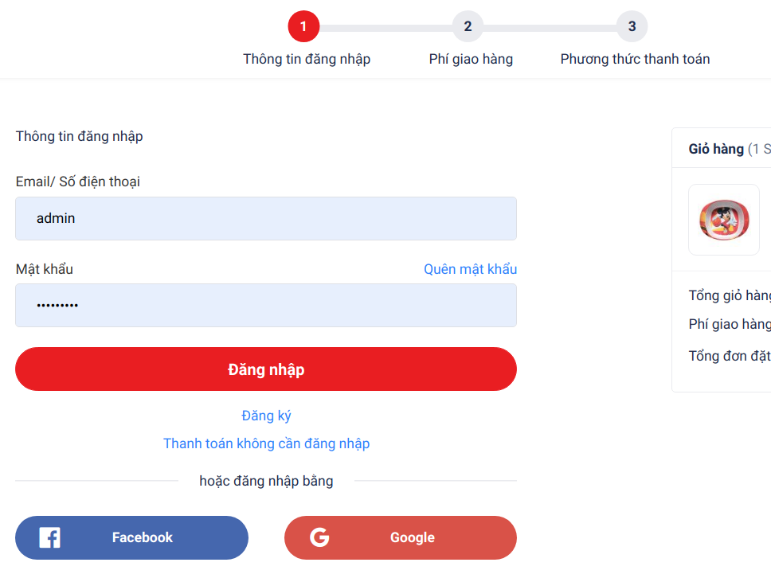

# mid_level_exercise
**Section 8: Customizing the Checkout Process**
**Exam 1:** Insert another step in checkout page.
Magento mặc định checkout 2 bước với sản phẩm physical (shipping & payment), 1 bước với sản phẩm virtual (payment).

Trong 1 dự án trước đây của công ty: Khách hàng yêu cầu thêm 1 bước trong checkout page, yêu cầu khách hàng đăng nhập trước khi thực hiện các bước còn lại của Magento.

Hãy phân tích và thực hiện yêu cầu này.

Ví dụ: (Đây là sản phẩm đã hoàn thiện của project đó)

**Exam 2:** Customize checkout form fields
Field Telephone của Magento cho phép nhập ký tự ngoài số.

Hãy customize lại field Telephone để field này chỉ cho phép các ký tự: 0-9, dấu cộng "+",  dấu trừ "-".

Exam 2: Customize checkout form fields
Field Telephone của Magento cho phép nhập ký tự ngoài số.

Hãy customize lại field Telephone để field này chỉ cho phép các ký tự: 0-9, dấu cộng "+",  dấu trừ "-".

**Exam 3:** New checkout form fields.
Field tạo 1 field text mới trong shipping address form cho phép người dùng nhập khung giờ mong muốn giao hàng

Tạo 1 Controller/API thực hiện validate khung giờ trên (E.g. 14h-21h)

Khi customer input vào field này trên trang checkout và bấm "Next", gửi ajax request đến Controller/API để validate và chỉ cho customer sang bước payment nếu validate thành công.

Yêu cầu test cả 2 trường hợp validate thành công và không thành công

Nếu không thành công phải thông báo lỗi ở dưới field

Việc validate phải diễn ra cùng form và cùng các fields khác (Phone Number, Street, City, ...)

Cho phép nhập và validate thông tin này ở cả REST API khi người dùng thực hiện call API đặt hàng**** New checkout form fields.
Field tạo 1 field text mới trong shipping address form cho phép người dùng nhập khung giờ mong muốn giao hàng

Tạo 1 Controller/API thực hiện validate khung giờ trên (E.g. 14h-21h)

Khi customer input vào field này trên trang checkout và bấm "Next", gửi ajax request đến Controller/API để validate và chỉ cho customer sang bước payment nếu validate thành công.

Yêu cầu test cả 2 trường hợp validate thành công và không thành công

Nếu không thành công phải thông báo lỗi ở dưới field

Việc validate phải diễn ra cùng form và cùng các fields khác (Phone Number, Street, City, ...)

Cho phép nhập và validate thông tin này ở cả REST API khi người dùng thực hiện call API đặt hàng
